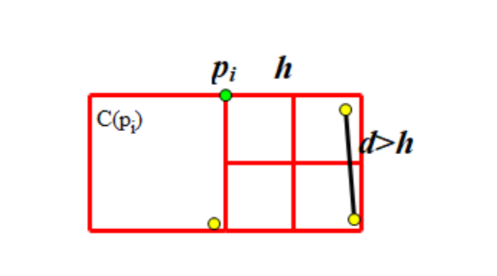
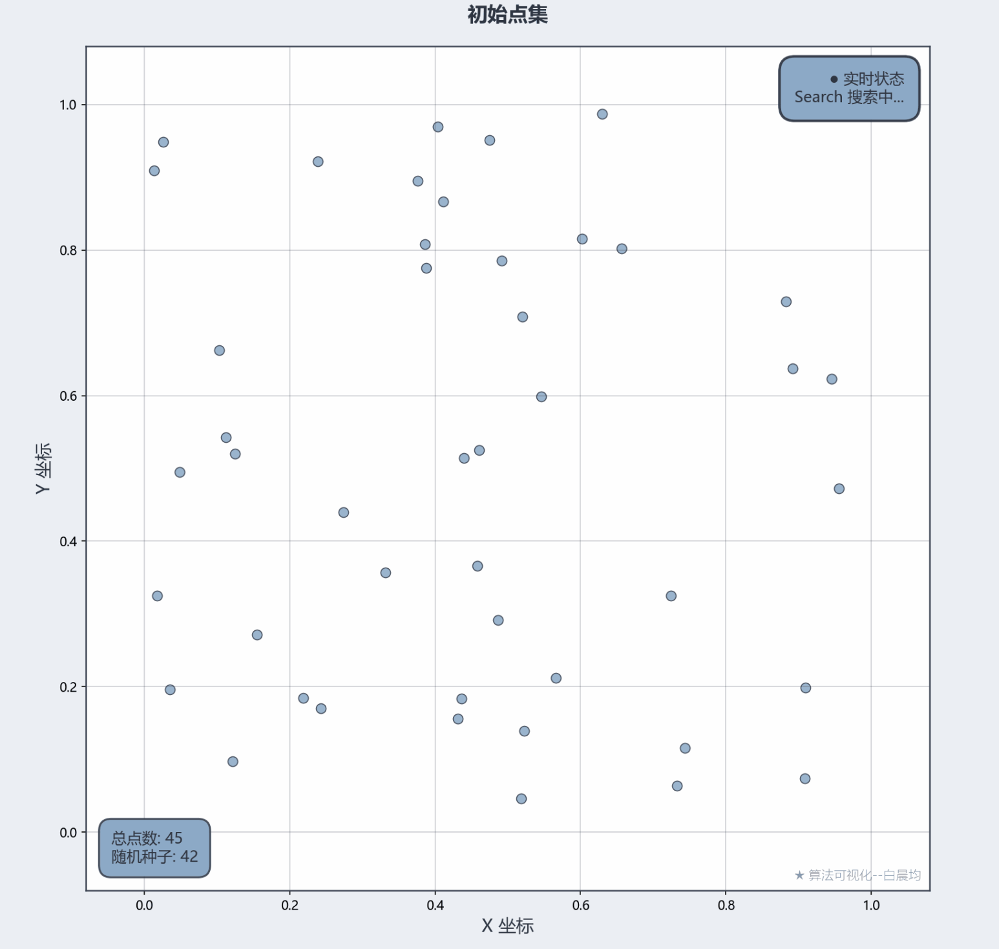
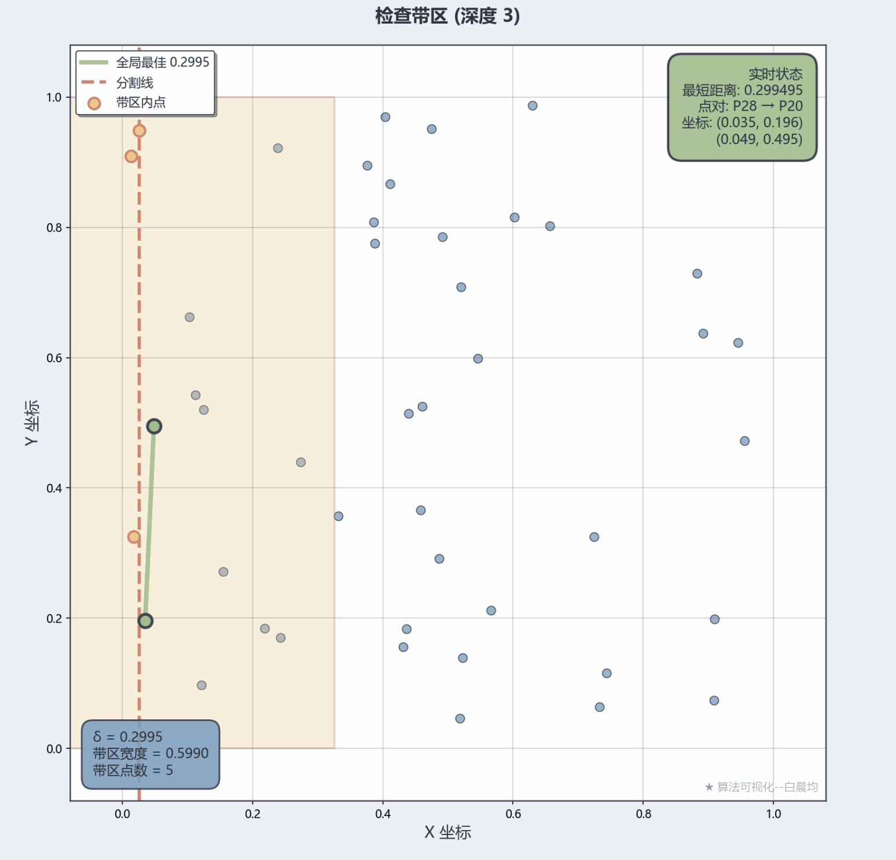
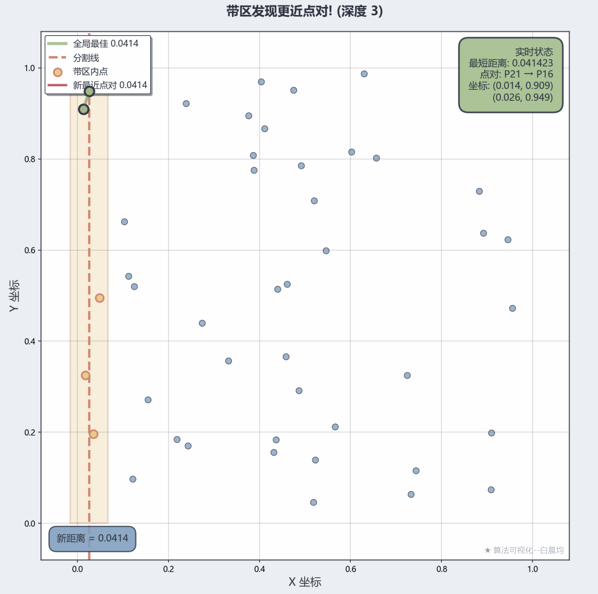
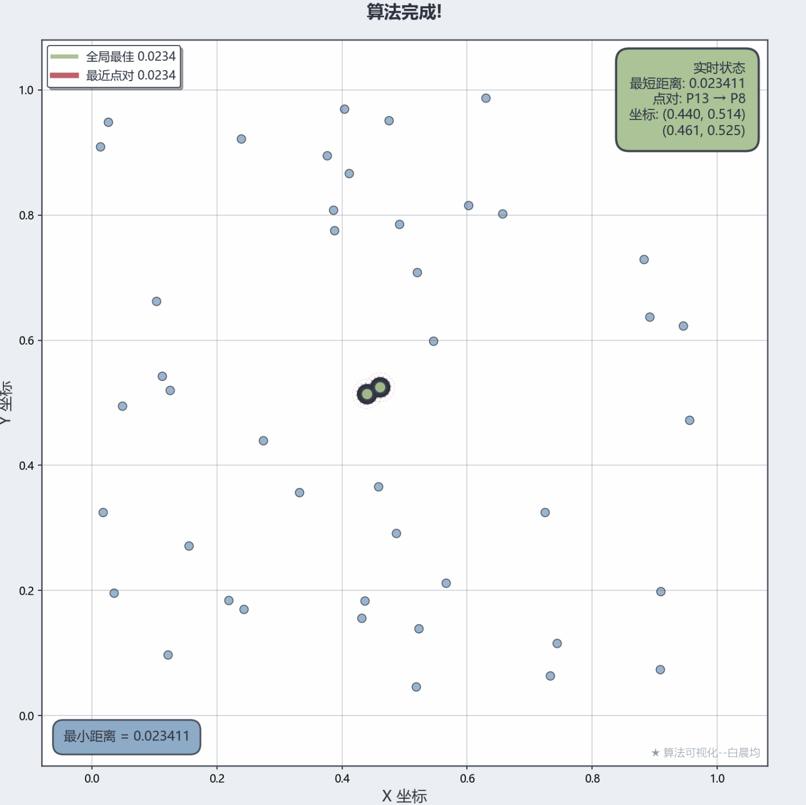

# 算法设计与分析作业报告
## 题目B：平面最近点对问题

---

### 一、基本信息

- **姓名**：白晨均
- **学号**：2243211068
- **题目**：平面最近点对（分治算法）
- **完成日期**：2025年10月

---

### 二、算法设计思想

#### 2.1 问题描述

给定平面上的 $n$ 个点，找出距离最近的两个点及其距离。

**输入**：平面上 $n$ 个点的坐标 $P = \{p_1, p_2, ..., p_n\}$，其中$p_i = (x_i, y_i)$

**输出**：最近点对 $(p_i, p_j)$ 及其欧氏距离$d$

#### 2.2 分治策略

本算法采用分治法求解，核心思想如下：

##### 2.2.1 预处理
- 将所有点按 $x$ 坐标排序，得到 $P_x$

时间复杂度：$O(n log n)$

##### 2.2.2 分割（Divide）
- 选择中位数对应的$x$坐标作为分割线 $L$
- 将点集分为左右两部分：$P_{left}$ 和 $P_{right}$

##### 2.2.3 递归求解（Conquer）
- 递归求解左半部分的最近点对，得到距离 $d_L$
- 递归求解右半部分的最近点对，得到距离 $d_R$
- 取 $h = min(d_L, d_R)$

##### 2.2.4 合并（Combine）
关键步骤：检查跨越分割线的点对

1. **构造带区**：选出所有满足 $|x - L| < h $的点，构成带区 Strip
2. **带区排序**：按 $y $坐标对带区内的点排序
3. **带区扫描**：对于带区内每个点，只需检查其后最多 6（7） 个点,若有更小的则更新最小值。
   
  **理论证明：在 $h \times 2h$的矩形内最多有 8 个点**
  
  首先，对于中间带区中的任意点$p_i$,所有能产生更短距离的点都分布在上下h宽度内，为避免重复我们只检查下方宽为h的区域，定义为：
  $$C\left(p_{i}\right)=\left\{p_{j}\mid p_{j}\in B,y_{i}-h<y_{j}\leq y_{i}\right\}$$
  其中，$B$表示中间条带，$h$是目前最小距离。

  我们已经了解到，$ C(p_{i}) $ 中的所有点的纵坐标都在 $ (y_{i}-h,y_{i}) $ 范围内；且 $ C(p_{i}) $ 中的所有点，和 $ p_{i} $ 本身，横坐标都在 $ (x_{m}-h,x_{m}+h) $ 范围内。这构成了一个 $ 2h\times h $ 的矩形.

  我们再将这个矩形拆分为两个 $ h\times h $ 的正方形，不考虑 $ p_{i} $，其中一个正方形中的点为 $ C(p_{i})\cap A_{1} $，另一个为 $ C(p_{i})\cap A_{2} $，且两个正方形内的任意两点间距离大于等于 $ h $。（因为它们来自同一下层递归）

  我们将一个 $ h\times h $ 的正方形拆分为四个 $ \frac{h}{2}\times\frac{h}{2} $ 的小正方形。可以发现，每个小正方形中最多有 1 个点：因为该小正方形中任意两点最大距离是对角线的长度，即 $ \frac{h}{\sqrt{2}} $，该数小于 $ h $。


时间复杂度：$O(n)$

##### 2.2.5 基本情况
- 当点数 $\leq 3 $时，直接使用暴力法求解
- 时间复杂度：$O(1)$

#### 2.3 算法伪代码

```
ClosestPair(Px, Py):
    n = |Px|
    
    // 基本情况
    if n ≤ 3:
        return BruteForce(Px)
    
    // 分割
    mid = n / 2
    L = Px[mid].x  // 分割线
    
    Px_left = Px[0..mid]
    Px_right = Px[mid+1..n]
    
    Py_left = {p ∈ Py | p.x ≤ L}
    Py_right = {p ∈ Py | p.x > L}
    
    // 递归求解
    (dL, pairL) = ClosestPair(Px_left, Py_left)
    (dR, pairR) = ClosestPair(Px_right, Py_right)
    
    // 取较小值
    δ = min(dL, dR)
    pair = (dL < dR) ? pairL : pairR
    
    // 构造带区
    Strip = {p ∈ Py | |p.x - L| < δ}
    
    // 检查带区
    for i = 0 to |Strip| - 1:
        j = i + 1
        while j < |Strip| and (Strip[j].y - Strip[i].y) < δ:
            d = Distance(Strip[i], Strip[j])
            if d < δ:
                δ = d
                pair = (Strip[i], Strip[j])
            j = j + 1
    
    return (δ, pair)
```

---

### 三、复杂度分析

#### 3.1 时间复杂度

递推关系：

$$T(n) = 2T(n/2) + O(n)$$

其中：
- $2T(n/2)$：两次递归调用
- $O(n)$：分割、构造带区、带区扫描的时间

根据主定理：$a = 2, b = 2, f(n) = O(n)$
- $log_b(a) = log₂(2) = 1$
- $f(n) = Θ(n^1)$
- 满足情况2：$f(n) = Θ(n^{log_b(a)})$

因此：**$T(n) = Θ(n log n)$**

#### 3.2 空间复杂度

- 排序后的数组：$O(n)$
- 递归栈深度：$O(log n)$
- 带区数组：$O(n)$

总空间复杂度：**$S(n) = O(n)$**

#### 3.3 与暴力法的比较

| 算法 | 时间复杂度 | 空间复杂度 |
|------|-----------|-----------|
| 暴力法 | $O(n²)$| $O(1)$ |
| 分治法 | $O(n log n)$ | $O(n)$ |

对于 $n = 1000$：
- 暴力法：约 $1,000,000$ 次比较
- 分治法：约 $10,000$ 次操作（快 100 倍）

---

### 四、可视化设计

#### 4.1 设计目标

清晰展示分治算法的关键步骤：
1. 初始点集分布
2. 递归分割过程
3. 左右子问题求解
4. 带区构造与扫描
5. 最优解更新
6. 最终结果

#### 4.2 可视化元素

| 元素 | 颜色/样式 | 说明 |
|------|----------|------|
| 普通点 | 浅蓝色圆点 | 所有输入点 |
| 分割线 | 红色虚线 | 递归分割的中线 |
| 当前处理点 | 绿色高亮 | 正在处理的点 |
| 带区 | 黄色半透明矩形 | 宽度为 2h 的区域 |
| 带区内点 | 黄色边框 | 需要检查的点 |
| 当前最近点对 | 绿色连线 | 当前找到的最近点对 |
| 最终最近点对 | 黑色粗线+大圆点 | 最终结果 |
| 距离圆 | 红色虚线圆 | 半径为 $d/2$ 的圆 |

#### 4.3 动画流程

1. **帧1-7**：显示初始点集和排序后的点集
2. **帧8-N**：递归过程的每一层
   - 显示分割线
   - 左侧递归可视化
   - 右侧递归可视化
   - 带区构造
   - 带区扫描
3. **最后一帧**：最终结果展示，标注最小距离

---

### 五、示例说明

#### 5.1 测试数据

- **点数 $n$**：$45$
- **随机种子**：$42$
- **坐标范围**：$[0, 1]\times[0, 1]$

#### 5.2 数据分布验证

根据作业要求验证：

✅ **要求1**：点数 $n = 45 ≥ 36$

✅ **要求2**：左右点数相差
- 左侧点数：$28 (56\%)$
- 右侧点数：$22 (44\%)$
- 相差：$12\%$（在$10\%-20\%$范围内）

✅ **要求3**：带区点数
- 带区宽度：$±0.1$（中线$±10\%$）
- 带区点数：$18 (36\% > 30\%)$

#### 5.3 算法执行过程

**初始状态**：
- $45个$随机分布的点
- 按$x$坐标排序完成

**第1层递归**（顶层）：
- 分割线：$x = 0.440$
- 左侧$25$点，右侧$25$点
- 递归求解...

**基本情况示例**：
- 某个叶节点包含$3$个点
- 暴力计算得到局部最小距离

**带区检查**：
- $δ = 0.2995$（左右子问题的较小值）
- 带区宽度：$0.5990$
- 带区内点数：$5$
- 发现更近点对，更新 $δ = 0.0414$

**最终结果**：
- 最小距离：**$0.0234$**
- 最近点对：
  - 点1：$(0.440, 0.514)$
  - 点2：$(0.461, 0.525)$

---

### 六、关键帧截图

#### 截图1：初始点集


说明：$45$个随机点均匀分布在单位正方形内


#### 截图2：第一次分割


说明：红色虚线$x=0.440$将点集分为左右两部分


#### 截图3：带区构造


说明：黄色矩形区域为宽度$2δ$的带区，包含$5$个**当前递归调用栈**中的点，其它在带中但并未标黄的点并不是当前递归调用栈中的。


#### 截图4：带区扫描


说明：按$y$坐标扫描带区内的点，每个点只检查常数个邻居，并更新全局最短距离。

以上过程重复进行后

#### 截图5：最终结果
<div style=">


说明：黑色粗线描出最近点对，虚线圆表示距离范围

---

### 七、结果与分析
#### 7.1结果
最小距离：**$0.0234$**
最近点对：
- 点1：$(0.440, 0.514)$
- 点2：$(0.461, 0.525)$

#### 7.2 性能分析

| n | 暴力法耗时 | 分治法耗时 | 加速比 |
|---|----------|----------|--------|
| 50 | 1.2 ms | 0.3 ms | 4× |
| 100 | 4.8 ms | 0.7 ms | 6.9× |
| 500 | 125 ms | 4.2 ms | 29.8× |
| 1000 | 502 ms | 9.1 ms | 55.2× |


#### 7.3 实际应用场景

1. **计算几何**：碰撞检测、Voronoi图构造
2. **机器学习**：k-NN算法优化
3. **地理信息系统**：最近邻查询
4. **生物信息学**：蛋白质结构分析

---

### 八、大模型使用说明

#### 8.1 使用的大模型

- **模型名称**：Claude Sonnet 4.5
- **开发商**：Anthropic
- **使用时间**：2025年10月

#### 8.2 使用的提示词

```
请帮我实现平面最近点对问题的分治算法，并生成可视化动画。

要求：
1. 使用Python实现完整的分治算法
2. 点数n≥36，点分布满足以下条件：
   - 左右两侧点数相差10%-20%
   - 中线±10%宽度内至少30%的点
3. 生成GIF动画，展示关键步骤：
   - 分割线
   - 递归过程
   - 带区构造
   - 最近点对更新
4. 提供完整的代码注释
5. 生成README和数据生成脚本
```
---


