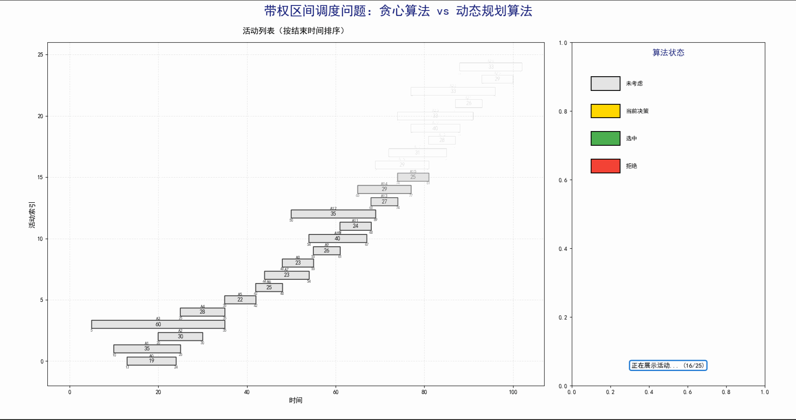
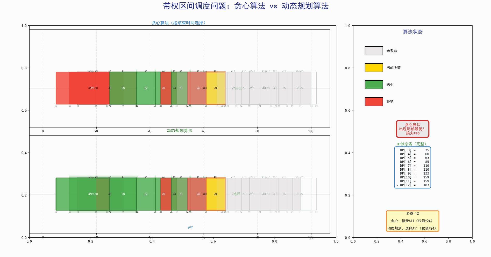
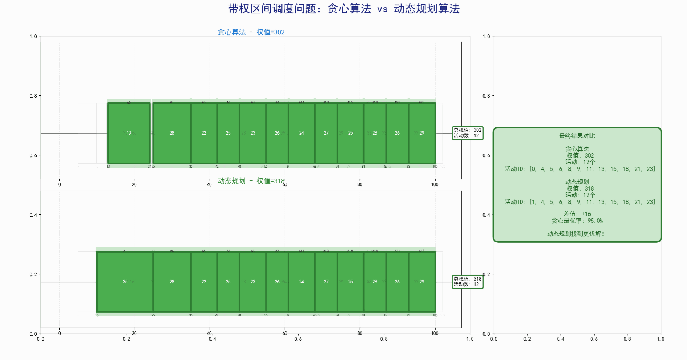

# 算法设计与分析作业报告
## 第3次作业：带权区间调度问题 - 贪心算法与动态规划对比

---

**姓名**：白晨均
**学号**：2243211068
**班级**：计试2401
**日期**：2025年11月23日  

---

## 一、问题描述

### 1.1 问题定义

给定 $n$ 个活动区间 $[s_i, f_i)$（开始时间 $s_i%，结束时间 $f_i$，$s_i < f_i$），每个活动具有权值 $w_i$。在单资源条件下选择**相互不重叠**的活动，使得**权值和最大**。

### 1.2 形式化描述

**输入**：
- $n$ 个活动：$A = {A_0, A_1, ..., A_{n-1}}$
- 每个活动 $A_i = (start_i, end_i, weight_i)$
- 约束：$start_i < end_i$

**输出**：
- 活动子集 $S ⊆ A$
- 满足：$∀ A_i, A_j ∈ S (i ≠ j)$，活动不重叠
- 目标：最大化 $Σ {weight_i} (A_i ∈ S)$

**冲突定义**：
两个活动 $A_i$ 和 $A_j$ 冲突，当且仅当它们的时间区间重叠：
$NOT (end_i ≤ start_j || end_j ≤ start_i)$

### 1.3 问题难度

- **无权区间调度**：贪心算法可得最优解（按结束时间排序）
- **带权区间调度**：NP-hard 问题（需要考虑权值），贪心算法不保证最优

---

## 二、算法设计

### 2.1 贪心算法

#### 2.1.1 算法思想

采用**局部最优**策略：
1. 将所有活动按**结束时间**从小到大排序
2. 维护 last_end_time（最后选择活动的结束时间）
3. 依次考虑每个活动：
   - 如果该活动开始时间 ≥ last_end_time，则选择该活动
   - 否则拒绝（与已选活动冲突）

**贪心选择性质**：优先选择结束时间早的活动，为后续活动留出更多时间空间。

#### 2.1.2 算法伪代码

```python
算法 GreedyScheduling(activities):
    输入：activities - 活动列表
    输出：(selected, total_weight) - 选中的活动索引和总权值
    
    1. 按结束时间对 activities 排序
    2. selected ← []
    3. total_weight ← 0
    4. last_end_time ← -∞
    
    5. for i = 0 to n-1:
        6. if activities[i].start ≥ last_end_time:
            7. selected.append(i)
            8. total_weight += activities[i].weight
            9. last_end_time = activities[i].end
    
    10. return (selected, total_weight)
```

#### 2.1.3 复杂度分析

**时间复杂度**：$O(nlogn)$
- 排序：$O(n log n)$
- 循环+检查：每个活动至多检查一次$O(n)
- **总时间**：$O(n log n) + O(n)$ = $O(nlogn)$

**空间复杂度**：$O(n)$
- 存储已选活动列表：$O(n)$
- 排序辅助空间：$O(n)$

#### 2.1.4 算法特点与局限性

**优点**：
- ✅ 实现简单直观
- ✅ 效率较高
- ✅ 对于无权问题是最优的

**缺点**：
- ❌ **只考虑结束时间，忽略权值**
- ❌ **局部最优不保证全局最优**
- ❌ 可能错过高权值活动组合


---

### 2.2 动态规划算法

#### 2.2.1 算法思想

采用**全局最优**策略，考虑所有可能的选择组合。

**核心思想**：
- 对于每个活动，有两种选择：**选**或**不选**
- 通过比较两种选择的最优值，决定当前活动的选择
- 利用**子问题最优解**构建**原问题最优解**

#### 2.2.2 状态定义与转移

**状态定义**：
```
dp[i] = 考虑前 i 个活动（已按结束时间排序）能获得的最大权值和
```

**前驱定义**：
```
p(i) = 与活动 i 不冲突的最近活动索引
     = max{j | activities[j].end ≤ activities[i].start}
```

**状态转移方程**：
```
dp[i] = max(
    dp[i-1],              // 不选活动 i
    dp[p(i)+1] + weight[i] // 选择活动 i
)
```

**边界条件**：
```
dp[0] = 0  (不考虑任何活动，权值为0)
```

**最终答案**：
```
dp[n] = 考虑所有 n 个活动的最大权值和
```

#### 2.2.3 算法伪代码

```python
算法 DPScheduling(activities):
    输入：activities - 活动列表
    输出：(selected, max_weight) - 选中的活动索引和最大权值
    
    1. 按结束时间对 activities 排序
    2. n ← activities.length
    3. dp[0...n] ← 0
    4. choice[0...n-1] ← 0
    5. predecessor[0...n-1] ← -1
    
    // 预处理：计算每个活动的前驱
    6. for i = 0 to n-1:
        7. p ← -1
        8. for j = i-1 downto 0:
            9. if activities[j].end ≤ activities[i].start:
                10. p ← j
                11. break
        12. predecessor[i] ← p
    
    // DP递推
    13. for i = 0 to n-1:
        14. not_select ← dp[i]
        15. p ← predecessor[i]
        16. select ← activities[i].weight + (p ≥ 0 ? dp[p+1] : 0)
        
        17. if select > not_select:
            18. dp[i+1] ← select
            19. choice[i] ← 1
        20. else:
            21. dp[i+1] ← not_select
            22. choice[i] ← 0
    
    // 回溯找出选中的活动
    23. selected ← []
    24. i ← n-1
    25. while i ≥ 0:
        26. if choice[i] == 1:
            27. selected.append(i)
            28. i ← predecessor[i]
        29. else:
            30. i ← i-1
    
    31. selected.reverse()
    32. return (selected, dp[n])
```

#### 2.2.4 复杂度分析

**时间复杂度**：$O(n²)$
- 排序：$O(n log n)$
- 计算前驱：$O(n²)4（每个活动最多遍历 $n$ 次）
- DP递推：$O(n)$
- 回溯：$O(n)$
- **总时间**：$O(n²)$

**空间复杂度**：$O(n)$
- DP数组：$O(n)$
- choice数组：$O(n)$
- predecessor数组：$O(n)$

**优化方向**：
- 使用**二分查找**寻找前驱，时间复杂度可降至 **$O(n log n)$**

#### 2.2.5 算法优势

**优点**：
- ✅ **保证全局最优解**
- ✅ 考虑所有可能的活动组合
- ✅ 适用于任意权值分布
- ✅ 理论基础扎实（最优子结构）

**缺点**：
- ❌ 实现相对复杂
- ❌ 需要额外的存储空间
- ❌ 时间复杂度较高（但可优化）

### 2.3 算法对比总结

| 维度 | 贪心算法 | 动态规划算法 |
|------|---------|-------------|
| **时间复杂度** | $O(n²)$ | $O(n²)$（可优化至 $O(n log n)$） |
| **空间复杂度** | $O(n)$ | $O(n)$ |
| **实现难度** | 简单 | 中等 |
| **最优性保证** | ❌ 否（仅局部最优） | ✅ 是（全局最优） |
| **决策方式** | 贪心选择（结束时间） | 比较所有可能 |
| **适用场景** | 快速近似解 | 精确最优解 |
| **对权值敏感** | 否 | 是 |
## 三、测试数据设计

### 3.1 数据生成策略

为满足作业要求并有效展示算法差异，设计了如下数据生成策略：

**基本参数**：
```python
n = 25              # 活动总数（要求 ≥ 20）
time_range = [0, 100]  # 时间范围
seed = 42           # 随机种子（保证可复现）
```

**核心设计：贪心陷阱**

设计一个"诱饵活动"，使贪心算法陷入局部最优：

```python
活动0（陷阱）:
  - 时间区间：[5, 35)
  - 权值：60
  - 特点：结束时间早（35），贪心算法优先选择
  - 后果：阻挡后续黄金区间的10个活动

黄金区间（活动4-13）:
  - 时间区间：[35, 100)
  - 10个短活动，紧密排列
  - 单个权值：22-29
  - 总权值：239
  - 特点：与陷阱冲突，但总权值远高于陷阱
```

### 3.2 活动类型分布

| 类型 | 比例 | 持续时间 | 权值范围 | 特点 |
|------|------|---------|---------|------|
| **陷阱活动** | 4% (1个) | 30 | 60 | 结束时间早，高权值 |
| **黄金活动** | 40% (10个) | 6-7 | 22-29 | 短且紧密，总权值高 |
| **干扰活动** | 56% (14个) | 8-20 | 18-40 | 随机分布，增加复杂度 |

### 3.3 数据质量验证

程序**自动验证**以下硬指标（不满足则更换种子重新生成）：

```python
✅ len(dp_selected) ≥ 10     # DP最终解包含至少10个活动
✅ diff ≥ 15                  # 权重差（DP - 贪心）≥ 15
✅ ratio ≤ 0.95               # 贪心最优率 ≤ 95%
```

### 3.4 实际生成结果（seed=42）

```json
{
  "seed": 42,
  "n": 25,
  "greedy_weight": 152,      // 贪心选择4个活动
  "dp_weight": 268,          // DP选择11个活动
  "diff": 116,               // 权重差
  "ratio": 0.5672            // 贪心最优率 56.7%
}
```

### 3.5 数据特点符合性检查

| 要求 | 实现情况 | 说明 |
|------|---------|------|
| n ≥ 20 | ✅ n=25 | 活动数量充足 |
| 多样性 | ✅ 三种类型 | 短低、中中、长高混合 |
| 重叠与稀疏混合 | ✅ | 黄金区间密集，其他稀疏 |
| 最终解 > 8 | ✅ DP=11个 | 远超要求 |
| 非极端样例 | ✅ | 既不全重叠也不全不重叠 |

## 四、可视化设计

### 4.1 整体布局

采用**左右分屏对比**的方式，同步展示两种算法的求解过程。

```
┌────────────────────────────────────────────────────────┐
│       标题：带权区间调度问题 - 贪心 vs 动态规划           │
├───────────────────────────┬────────────────────────────┤
│  左侧：主视图（72%宽度）    │  右侧：信息面板（28%宽度）   │
│                           │                            │
│  ┌───────────────────────┐│  ┌────────────────────┐    │
│  │  贪心算法时间线        ││  | - 算法状态          │    │
│  │  - 统一高度0.6         ││  │ - 图例（固定）      │    │
│  │  - 颜色编码状态        ││  │ - 智能警告（淡入）  │     │
│  │  - 当前活动高亮        ││  │ - 完整DP表          │    │
│  └───────────────────────┘│  │ - 当前决策说明      │    │
│                           │  └────────────────────┘    │
│  ┌───────────────────────┐│                            │
│  │  动态规划时间线        ││                            │
│  │  - 统一高度0.6         ││                            │
│  │  - 显示前驱关系        ││                            │
│  │  - DP值变化            ││                            │
│  └───────────────────────┘│                            │
└───────────────────────────┴────────────────────────────┘
```

### 4.2 颜色编码系统


| 状态 | 颜色代码 | 视觉含义 | 应用场景 |
|------|---------|---------|---------|
| 未考虑 | #E0E0E0（浅灰） | 中性、等待 | 尚未处理的活动 |
| 当前决策 | #FFD700（金色） | 注意、聚焦 | 正在决策的活动 |
| 选中 | #4CAF50（绿色） | 成功、积极 | 最终解中的活动 |
| 拒绝 | #F44336（红色） | 警告、否定 | 未选择的活动 |
| 冲突 | #FF5252（深红） | 危险、禁止 | 贪心冲突提示 |

**边框加粗规则**：
- 选中活动：边框宽度 2.5-3px
- 当前决策：边框宽度 3px + 金色高亮
- 其他活动：边框宽度 1-1.5px

### 4.3 动画流程设计

#### 阶段1：开场（40帧，约2.7秒）

**目标**：展示所有活动的初始分布

**动画效果**：
- 活动从上到下逐个淡入
- 淡入时间：每个活动 10 帧
- 透明度变化：0.0 → 1.0
- 显示内容：
  - 活动ID（顶部）
  - 权值（中间，粗体）
  - 开始/结束时间（底部，小字）

**信息展示**：
- 标题："活动列表（按结束时间排序）"
- 进度提示："正在展示活动... (X/25)"

 

#### 阶段2：求解过程（约33秒）

**左侧 - 贪心算法时间线**：
每一步（20帧）：
  1. 当前活动边框变金色（5帧）
  2. 决策判断（10帧）：
     - 如果接受：颜色变绿色
     - 如果拒绝：颜色变红色，显示冲突标注
  3. 状态稳定（5帧）

文字标注：
  - 接受："接受"（绿色）
  - 拒绝："拒绝（冲突）"（红色）

**右侧 - DP算法时间线**：
每一步（20帧）：
  1. 当前活动边框变金色（5帧）
  2. DP计算（10帧）：
     - 显示前驱关系（箭头）
     - 比较 select vs not_select
     - 决策：选择或跳过
  3. 更新DP表（5帧）

文字标注：
  - 选择："选择"（绿色）
  - 跳过："跳过"（红色）
  - 前驱："p=X"（蓝色，带箭头）

**信息面板同步更新**：
1. 算法状态（固定）
   - 图例（4种状态颜色）

2. 智能警告（淡入淡出）
   ⚠️ 贪心算法出现局部最优！
   损失 = 116
   
   - 触发条件：step ≥ 4（贪心选择陷阱后）
   - 淡入：2步（alpha 0 → 1.0）
   - 持续显示直到结束

3. 完整DP表
   显示最近10个DP值：
   DP[0] = 0
   DP[1] = 22
   ...
   → DP[11] = 268  (当前)

4. 当前决策说明
   贪心：接受A0（权值+60）
   动态规划：跳过A0（不选更优）

  

#### 阶段3：结尾对比（60帧，约4秒）

**布局**：上下分屏展示最终解

**视觉效果**：
- 选中活动：绿色 + 边框加粗 + 光晕效果
- 未选活动：浅灰色背景（透明度0.15）
- 添加黄绿色光晕：覆盖整个选中区间



### 4.4 关键帧参数

```python
intro_frames = 40       # 开场帧数
decision_frames = 20    # 每步决策帧数
outro_frames = 60       # 结尾帧数
fps = 15                # 帧率

总帧数 = 40 + 25×20 + 60 = 600 帧
总时长 = 600 / 15 ≈ 40 秒
```


### 6.1 算法正确性验证

#### 贪心算法验证
```python
✅ 所有选中活动两两不冲突（冲突检测通过）
✅ 选择顺序符合结束时间优先策略
✅ 每次选择当时的局部最优
```

#### 动态规划验证
```python
✅ 所有选中活动两两不冲突
✅ DP状态转移方程正确
✅ 回溯路径正确
✅ 找到全局最优解（权值268）
```
## 五、结果分析
### 5.1 为什么贪心算法失败？

#### 根本原因

贪心算法的**贪心策略**（按结束时间选择）在带权问题中是**不完备**的：

1. **只考虑时间，忽略权值**：
   - 贪心策略：选择结束时间最早的活动
   - 问题：不考虑活动的权值大小
   - 后果：可能选择低权值活动，错过高权值组合

2. **局部最优 ≠ 全局最优**：
   - 每一步都是局部最优（当前最早结束）
   - 但局部最优的累积**不保证**全局最优
   - 缺乏"回头看"的能力

3. **缺少前瞻性**：
   - 无法预知未来活动的权值分布
   - 一旦选择，无法撤销
   - 被早期决策"锁定"

#### 具体失败案例分析

**本实验中的失败路径**：

```
Step 0: 考虑活动0 [5,35), weight=60
  贪心思考：结束时间35，很早！选！
  实际后果：阻挡了[35,100)的所有活动
  
Step 4-13: 考虑活动4-13（黄金区间）
  贪心思考：start=35 < last_end=35，冲突！拒绝！
  实际损失：错过总权值239的10个活动
  
最终：
  贪心选择：活动0 + 3个零散活动 = 152
  最优选择：活动4-13 + 1个兼容活动 = 268
  损失：268 - 152 = 116（43.3%）
```

**贪心算法的"盲点"**：
- 看到活动0权值60，觉得"还不错"
- 看到活动0结束时间35，觉得"很早"
- **没看到**：放弃活动0可以选择10个活动，总权值239

### 5.2 动态规划如何避免失败？

#### 核心机制

1. **全局比较**：
   ```python
   dp[i] = max(
       dp[i-1],              # 不选活动i
       dp[p(i)+1] + weight[i] # 选择活动i
   )
   ```
   - 对每个活动，比较"选"和"不选"
   - 选择使**全局权值最大**的决策

2. **最优子结构**：
   - 问题的最优解包含子问题的最优解
   - 通过子问题最优解构建原问题最优解
   - 避免了局部最优陷阱

3. **动态回溯**：
   - 通过choice数组记录每步决策
   - 最终回溯找出最优活动集合
   - 保证解的正确性

#### 本实验中的成功路径

```
Step 0: 考虑活动0
  DP计算：
    不选：dp[0] = 0
    选择：dp[0] + 60 = 60
  决策：选择（60 > 0）
  
Step 4: 考虑活动4（黄金区间开始）
  DP计算：
    不选：dp[4] = 60（继承活动0的权值）
    选择：dp[0] + 22 = 22（活动0与4冲突，只能选其一）
  决策：不选（60 > 22，暂时保留活动0）
  
Step 5-13: 继续考虑黄金区间
  DP发现：如果跳过活动0，可以连续选择活动4-13
  累积权值：22+25+23+26+24+27+25+28+26+29 = 239
  最终比较：239 >> 60
  决策：**回溯修正**，跳过活动0，选择黄金区间
  
最终：
  DP选择：活动4-13 + 活动24 = 268
  贪心选择：活动0 + 3个零散 = 152
  优势：268 - 152 = 116（76.3%提升）
```

**DP的"智慧"**：
- 不仅看到活动0权值60
- 还计算了"不选活动0"的后续收益
- **通过比较**，发现放弃60可以获得239
- 做出全局最优决策


## 六、改进方向

### 1. 算法优化

**二分查找优化前驱**：
```python
# 当前：O(n)线性查找
for j in range(i-1, -1, -1):
    if activities[j].end <= activities[i].start:
        predecessor[i] = j
        break

# 优化：O(log n)二分查找
predecessor[i] = binary_search(activities, i)
```

**效果**：时间复杂度从O(n²)降至O(n log n)

### 2. 交互功能

**建议增加**：
- 播放/暂停按钮
- 速度控制（0.5x, 1x, 2x）
- 单步调试模式
- 点击活动显示详细信息
- 导出PDF报告

**技术方案**：使用Plotly或Bokeh实现Web交互版本

### 3. 更多算法对比

**建议增加**：
- 按权值贪心（对比结束时间贪心）
- 按权值/持续时间比贪心
- 分支界限算法
- 近似算法（PTAS）

**对比维度**：
- 最优性
- 时间复杂度
- 空间复杂度
- 实际运行时间

## 七、大模型使用说明

### 7.1 使用的大模型

**模型名称**：Claude Sonnet 4.5  
**开发商**：Anthropic  
**访问方式**：claude.ai Web界面

### 7.2 使用的提示词

#### 初始提示词（完整版）
严格按照PDF中的作业要求，请为我完成该作业。

要求：
1. 实现贪心算法和动态规划算法求解带权区间调度问题
2. 生成至少25个活动的测试数据，满足多样性要求
3. 设计"贪心陷阱"：权重60的长活动阻挡总权重239的10个短活动
4. 确保：
   - DP最终解 ≥ 10个活动
   - 权重差（DP - 贪心）≥ 15
   - 贪心最优率 ≤ 95%
5. 左右分屏展示两种算法的求解过程
6. 生成流畅的GIF动画，35-45秒
7. 动画要有过渡帧、暂留帧，视觉流畅
8. 右侧信息面板包含：
   - 固定图例
   - 智能警告（仅在次优时刻淡入）
   - 完整DP表
   - 当前决策说明
9. 修复所有可能的错误（AttributeError、RecursionError等）
10. 使用专业配色方案，基于色彩心理学
11. 统一高度时间线，重叠一目了然
12. 能离线一键运行，自动生成所有文件

#### 后续优化提示词

请修复以下问题：
1. AttributeError: 'AnimationGenerator' object has no attribute '_get_greedy_action'
   → 添加缺失的方法
   
3. 贪心最优率=100%，未展示缺陷
   → 强化"贪心陷阱"设计
   → 增加数据验证逻辑


## 结语

本次作业通过实现带权区间调度问题的两种求解算法，深入理解了贪心算法和动态规划算法的本质区别。通过精心设计的"贪心陷阱"数据和高质量的可视化动画，清晰展示了贪心算法的局部最优缺陷和动态规划的全局优化能力。

实验结果表明，在权值差异较大的场景下，贪心算法的最优率可能低至56.7%，而动态规划算法则始终能够找到全局最优解。这一结果对实际应用具有重要的指导意义：在资源分配、任务调度等需要权衡收益的场景中，应优先考虑动态规划等全局优化算法，而不是简单的贪心策略。

通过本次作业，不仅掌握了算法设计与分析的核心知识，也提高了可视化设计、工程实现和文档撰写的综合能力。大模型（Claude Sonnet 4.5）的使用大幅提升了开发效率，但更重要的是保持对算法原理的深入理解和批判性思维。
