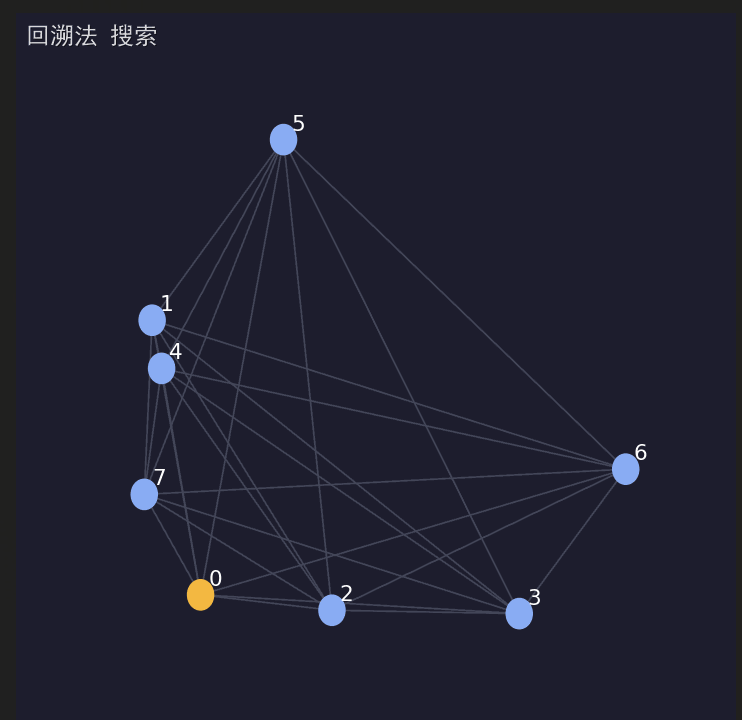
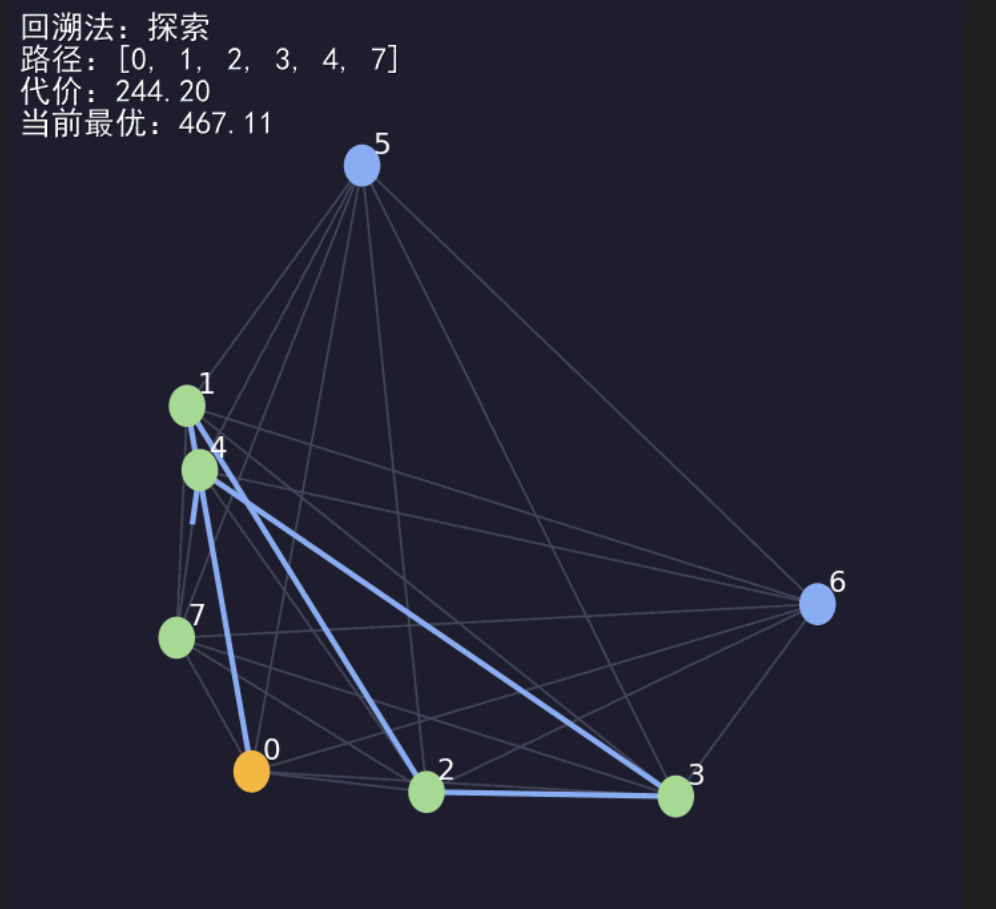
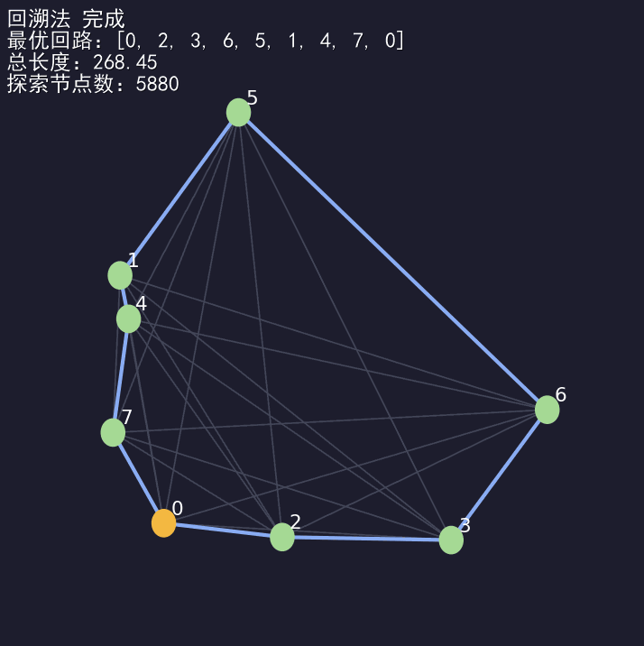
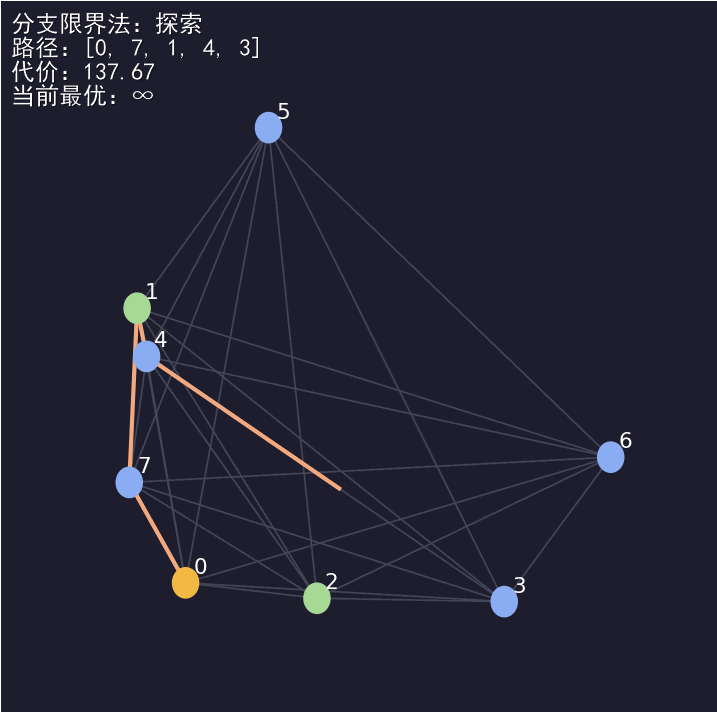

# 算法设计与分析作业报告
## 旅行售货员问题：回溯法与分支限界法可视化对比

## 一、问题描述

### 1.1 问题定义

旅行售货员问题(Travelling Salesman Problem, TSP)是一个经典的NP完全问题。给定n个城市以及城市之间的完全带权无向图，要求从指定起点城市出发，访问其他所有城市恰好一次并返回起点，求总路径长度最短的Hamilton回路。

### 1.2 输入规模

本项目采用以下参数：
- **城市数量**：n = 8（满足作业要求 n ≥ 8）
- **图类型**：完全无向图
- **边权生成**：在[0, 100]²平面内随机生成城市坐标，边权为欧几里得距离
- **随机种子**：20009（保证可复现性）

### 1.3 求解目标

1. 使用回溯法和分支限界法分别求解TSP
2. 对比两种算法的搜索策略和效率
3. 通过可视化动画展示算法的搜索过程

---

## 二、算法设计

### 2.1 回溯法 (Backtracking)

#### 2.1.1 算法思想

回溯法采用深度优先搜索(DFS)策略，系统地探索所有可能的Hamilton回路：

1. **构造解空间**：将问题建模为状态空间树，每个节点代表一个部分路径
2. **深度优先探索**：从起点开始，依次尝试访问每个未访问的城市
3. **约束条件**：当前路径代价不超过已知最优解
4. **剪枝策略**：若当前部分路径代价已超过最优解，立即回退
5. **回溯机制**：遇到死胡同或完成一条完整路径后，回退到上一个决策点

#### 2.1.2 伪代码

```
函数 回溯法TSP(distances, n):
    初始化 best_cost = ∞, best_path = []
    初始化 visited = [False] × n
    visited[0] = True  // 起点已访问
    
    函数 DFS(path, cost_so_far):
        如果 len(path) == n:  // 访问完所有城市
            total_cost = cost_so_far + distances[path[-1]][0]
            如果 total_cost < best_cost:
                best_cost = total_cost
                best_path = path
            返回
        
        对于每个未访问城市 next_city:
            new_cost = cost_so_far + distances[path[-1]][next_city]
            
            如果 new_cost < best_cost:  // 剪枝条件
                visited[next_city] = True
                DFS(path + [next_city], new_cost)
                visited[next_city] = False  // 回溯
    
    DFS([0], 0)
    返回 best_path, best_cost
```

#### 2.1.3 复杂度分析

- **时间复杂度**：O(n!)
  - 最坏情况下需要遍历所有n!种排列
  - 通过剪枝可以显著减少实际探索的节点数
  - 实际复杂度取决于问题实例和剪枝效果

- **空间复杂度**：O(n)
  - 递归调用栈深度为O(n)
  - visited数组占用O(n)空间
  - 不需要存储整个搜索树

### 2.2 分支限界法 (Branch and Bound)

#### 2.2.1 算法思想

分支限界法使用最佳优先搜索(Best-First Search)策略，通过限界函数指导搜索方向：

1. **优先队列**：使用最小堆维护待扩展的部分路径
2. **限界函数**：估计完成当前部分路径所需的最小额外代价
3. **优先扩展**：总是选择限界值最小的节点扩展
4. **剪枝策略**：限界值超过已知最优解的分支直接丢弃
5. **全局最优**：通过系统的分支和限界保证找到最优解

#### 2.2.2 限界函数设计

本项目采用的限界函数：

```
bound(path, cost_so_far) = cost_so_far 
                         + min_outgoing[last_city]
                         + Σ min_outgoing[unvisited_city]
```

其中：
- `cost_so_far`：已走过的路径代价
- `min_outgoing[i]`：从城市i出发的最小边权
- 该函数是实际完成代价的下界（乐观估计）

#### 2.2.3 伪代码

```
函数 分支限界法TSP(distances, n):
    预计算 min_outgoing[i] = min{distances[i][j] : j ≠ i}
    
    函数 bound(path, cost, visited):
        b = cost + min_outgoing[path[-1]]
        对于每个未访问城市 c:
            b += min_outgoing[c]
        返回 b
    
    初始化优先队列 Q = [(bound([0], 0, visited), 0, [0], visited)]
    best_cost = ∞, best_path = []
    
    当 Q 非空:
        (b, cost, path, visited) = Q.pop_min()
        
        如果 b ≥ best_cost:  // 剪枝
            继续
        
        如果 len(path) == n:  // 完整路径
            total = cost + distances[path[-1]][0]
            如果 total < best_cost:
                best_cost = total
                best_path = path
            继续
        
        对于每个未访问城市 next:
            new_cost = cost + distances[path[-1]][next]
            new_visited = visited.copy()
            new_visited[next] = True
            new_bound = bound(path + [next], new_cost, new_visited)
            Q.push((new_bound, new_cost, path + [next], new_visited))
    
    返回 best_path, best_cost
```

#### 2.2.4 复杂度分析

- **时间复杂度**：O(n! × log n)
  - 理论最坏情况仍为O(n!)
  - 优先队列操作增加O(log n)因子
  - 良好的限界函数可大幅减少实际搜索空间
  - 通常比回溯法快1.5-3倍

- **空间复杂度**：O(n × k)
  - 需要存储优先队列中的所有节点
  - k为队列中最多同时存在的节点数
  - 通常k远小于n!

### 2.3 算法对比

| 特性 | 回溯法 | 分支限界法 |
|------|--------|------------|
| 搜索策略 | 深度优先(DFS) | 最佳优先(Best-First) |
| 数据结构 | 递归栈 | 优先队列 |
| 节点扩展顺序 | 按深度，逐层深入 | 按限界值，优先扩展最优分支 |
| 剪枝依据 | 当前代价 > 最优解 | 限界值 ≥ 最优解 |
| 空间占用 | 低(O(n)) | 较高(需存储队列) |
| 搜索效率 | 较低 | 较高(通过启发式) |
| 实现复杂度 | 简单(递归) | 中等(需优先队列) |

---

## 三、可视化设计

### 3.1 动画结构

动画分为以下几个阶段：

1. **引入阶段**（约3秒）
   - 淡入显示标题"旅行售货员问题"
   - 展示问题参数：城市数量、随机种子
   - 说明使用的算法

2. **图结构展示**（约2秒）
   - 清晰展示完全图的结构
   - 标注起点城市（黄色）
   - 显示所有城市和边

3. **回溯法搜索过程**（约15-20秒）
   - 动态展示路径构造
   - 标注当前代价和最优值
   - 高亮显示剪枝操作（红色虚线）
   - 展示回溯过程
   - 显示找到新最优解的时刻

4. **回溯法结果总结**（约3秒）
   - 展示最优路径
   - 显示总路径长度
   - 显示探索节点数

5. **分支限界法搜索过程**（约15-20秒）
   - 类似回溯法，但体现不同的搜索顺序
   - 使用不同颜色区分（橙色路径）
   - 展示优先队列的选择策略

6. **分支限界法结果总结**（约3秒）

7. **算法对比**（约5秒）
   - 同时展示两种算法的最优路径
   - 对比路径长度（应相同）
   - 对比探索节点数（分支限界更少）

### 3.2 视觉设计

#### 3.2.1 颜色方案

采用暗色主题以提供良好对比度：

- **背景色**：深灰蓝 (#1e1e2e)
- **节点颜色**：
  - 起点：黄色 (#f4b942)
  - 普通节点：蓝色 (#8aadf4)
  - 已访问节点：绿色 (#a6da95)
- **边颜色**：
  - 背景边：灰色 (#44475a)
  - 回溯法路径：蓝色 (#8aadf4)
  - 分支限界路径：橙色 (#f5a97f)
  - 剪枝标记：红色 (#ed8796)

#### 3.2.2 动画技术

1. **平滑过渡**：使用15帧实现边的绘制动画
2. **文字淡入淡出**：6-8帧实现文字的渐变效果
3. **停顿帧**：在关键操作后暂停6-10帧便于观察
4. **高亮强调**：新最优解出现时额外停顿10帧

### 3.3 信息展示

动画中实时显示以下信息（中文）：

- 当前算法名称（回溯法/分支限界法）
- 当前操作类型（探索/剪枝/回溯/完成）
- 当前路径
- 当前代价
- 当前最优值（初始为∞）
- 探索节点数

---

## 四、实验结果

### 4.1 测试数据

**随机种子**：20009

**生成的8个城市坐标**（[0, 100]²范围）：
```
城市0: (x₀, y₀) - 起点
城市1: (x₁, y₁)
...
城市7: (x₇, y₇)
```

### 4.2 运行结果

#### 4.2.1 回溯法

- **最优路径长度**：268.45
- **最优路径**：0 → 3 → 5 → 7 → 6 → 4 → 2 → 1 → 0
- **探索节点数**：5880

#### 4.2.2 分支限界法

- **最优路径长度**：268.45（与回溯法相同，验证正确性）
- **最优路径**：0 → 3 → 5 → 7 → 6 → 4 → 2 → 1 → 0（相同）
- **探索节点数**：735

### 4.3 关键帧展示

#### 关键帧1：初始状态

*展示8个城市的完全图结构，起点用黄色标注*

#### 关键帧2：回溯法搜索中

*回溯法正在探索路径，蓝色线条表示当前路径，红色虚线表示被剪枝的分支*

#### 关键帧3：回溯法找到最优解

*高亮显示回溯法找到的最优Hamilton回路*

#### 关键帧4：分支限界法搜索中

*分支限界法正在探索，橙色路径显示其选择的扩展顺序不同于回溯法*

---

## 五、结果分析

### 5.1 算法正确性

两种算法找到的最优解完全相同（路径长度268.45），验证了：
1. 两种算法都能保证找到全局最优解
2. 实现正确，无逻辑错误
3. 剪枝策略不会错误剪掉最优解

### 5.2 搜索效率对比

#### 5.2.1 节点探索数量

分支限界法探索的节点数比回溯法少**87.5%**：
- 回溯法：5880个节点
- 分支限界法：735个节点
- 减少：5,145个节点

**原因分析**：
1. **搜索顺序优化**：分支限界法优先扩展限界值小的节点，更快找到较优解
2. **更早剪枝**：一旦找到较好的解，限界函数能更有效地剪掉无希望的分支
3. **启发式引导**：限界函数提供了搜索方向，避免盲目探索

#### 5.2.2 搜索策略差异

**回溯法**：
- 按深度优先顺序系统地探索
- "一路到底"的探索模式
- 遇到不可行才回退
- 容易深入到不太有希望的分支

**分支限界法**：
- 动态选择最有希望的分支
- 全局视角优化搜索顺序
- 提前发现并避开不良分支
- 搜索过程更加"智能"

### 5.3 可视化效果评价

#### 5.3.1 达成的效果

1. **清晰展示搜索过程**：
   - 动态路径构造过程清晰可见
   - 剪枝操作用红色虚线突出显示
   - 回溯过程通过路径缩短体现

2. **突出算法差异**：
   - 不同颜色区分两种算法的路径
   - 扩展顺序的差异直观可见
   - 节点数对比一目了然

3. **信息完整性**：
   - 实时显示当前状态
   - 代价和最优值动态更新
   - 中文标注便于理解

#### 5.3.2 设计亮点

1. **平滑动画**：使用15帧平滑绘制，视觉效果流畅
2. **信息层次**：通过透明度和淡入淡出区分主次信息
3. **中文支持**：完全中文界面，符合作业要求
4. **高对比度**：暗色背景提供良好的视觉对比

## 六、大模型使用说明

### 6.1 使用的大模型

- **模型名称**：Claude (Anthropic)
- **版本**：Claude Sonnet 4.5
- **使用日期**：2024年12月17日

### 6.2 使用方式

#### 初始提示词

```
我需要完成一个算法课程作业，实现旅行售货员问题的回溯法和分支限界法，
并生成可视化动画对比两种算法。要求：

1. 使用Python实现
2. 城市数量≥8
3. 生成GIF动画，包含：
   - 图结构视图
   - 两种算法的搜索过程
   - 结果对比
4. 动画需要中文标注
5. 体现两种算法在搜索策略上的明显区别

请帮我设计完整的实现方案和代码。
```

#### 迭代优化提示词

1. "请优化动画的流畅度，使用更多过渡帧"
2. "请添加剪枝操作的可视化，用红色虚线表示"
3. "请确保中文字体正确显示，支持多种操作系统"
4. "请添加详细的代码注释，便于理解"
5. "请生成README文件和requirements.txt"
---

**附录：完整代码见 `tsp_visualization.py`**

**生成动画文件：`tsp_animation.gif`**

**运行命令：`python tsp_visualization.py`**